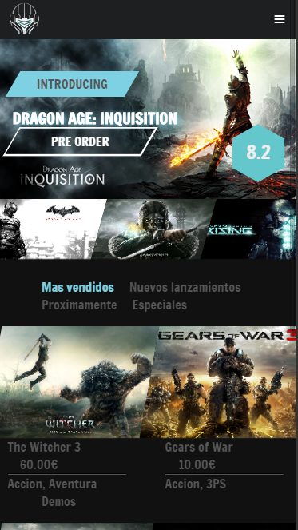
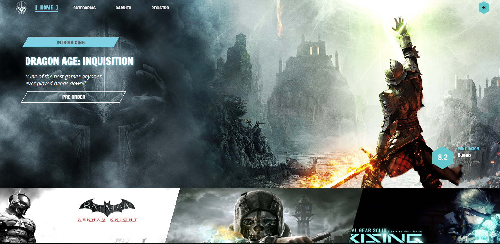
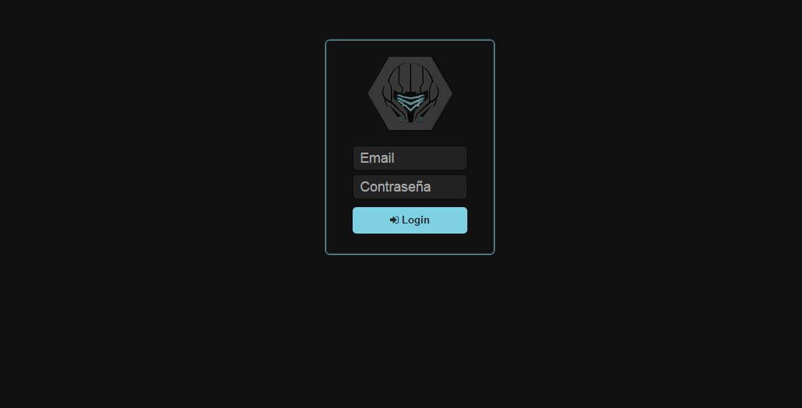
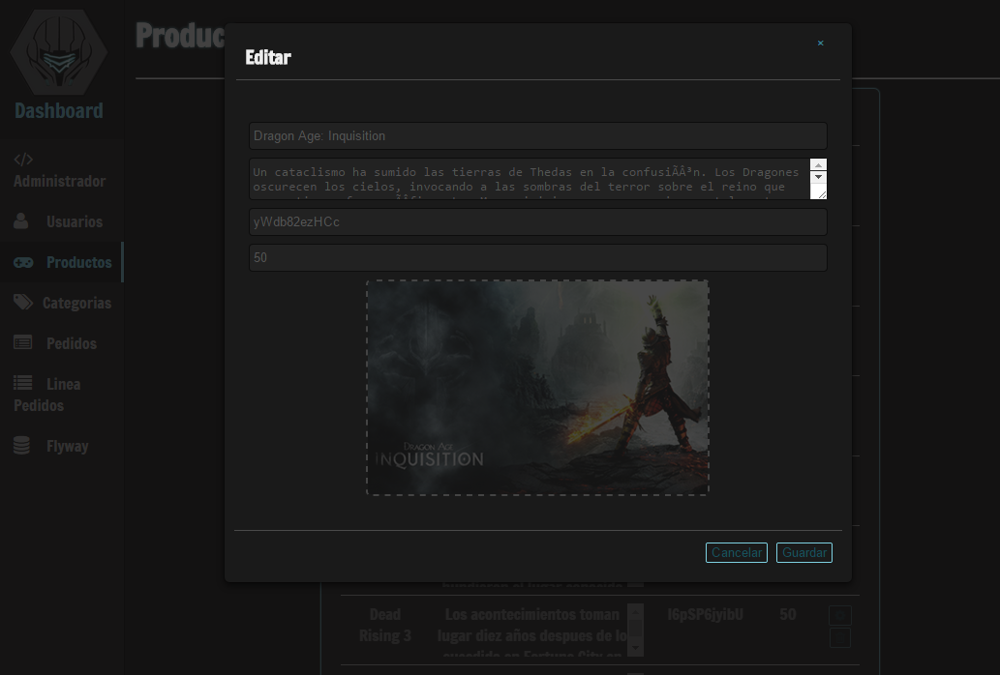

<h1><a href="http://metrogames-slem.rhcloud.com/">MetroGames</a></h1>

Web GameStore project for DAW

<h3>Tecnologies</h3>
<ul>
  <li>Php</li>
  <li>JS</li>
  <li>Jquery</li>
  <li>MySQL</li>
  <li>Node webkit</li>
  <li>Sass</li>
  <li>Own
    <ul>
      <li>PHP DAO</li>
      <li><a href="https://github.com/Eslem/DBSchemaPhp">PHP Database Schema</a></li>
      <li><a href="https://github.com/Eslem/MyAngularWay">JS controllers, views, routes</a></li>
    </ul></li>
</ul>

<h3>Features</h3>
<ul>
  <li>Games List with details and video</li>
  <li>Login/Register</li>
  <li>Categories</li>
  <li>Responsive</li>
  <li>Payment with bank <a href="https://github.com/Eslem/DWS-Banco">(own api)</a></li>
  <li>Cart with DB and cookies</li>
  <li>Sessions</li>
  <li><a href="http://metrogames-slem.rhcloud.com/admin">Admin Page<a> 
    <ul>
      <li>List and edition of fames, users, orders...etc</li>
      <li>Desktop app with nodeWebkit</li>
      <li>Function to database schema</li>
      <li><a href="https://github.com/Eslem/UploadImage">Image Upload with resize and canvas</a></li>
    </ul></li>
</ul>

<h3>Scheenshots</h3>
<h4>Client</h4>

<h4>Admin</h4>

